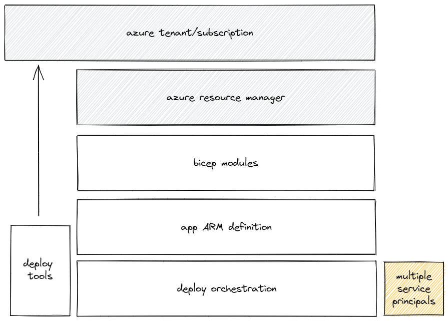

# Orchestrating 'Last Mile' Deployment Tasks

## Status

Draft

## Context

When deploying Azure-based solutions, many of the tasks required to go from zero to a fully-working solution can be automated using Azure Resource Manager (ARM) templates.  However, there are often a number of tasks that require configuration of systems that cannot be natively managed via ARM - for example, changes to Azure Active Directory (AAD) objects.

In order to meet such heterogenous automation requirements, the typical approach is to orchestrate the overall process via a separate scripted solution that ensures all the required tasks (including deployment of ARM templates) are executed in the correct sequence and that they complete successfully.  Whilst such 'wrapper' scripts are often relatively simple, in terms of the tasks they perform, they inherit other ancillary concerns which increases the overall complexity. For example:

* logging and error handling behaviour
* retry logic
* integration with configuration/secrets management systems
* identity management for different parts of the process

However, ARM includes a [Deployment Scripts](https://docs.microsoft.com/en-us/azure/azure-resource-manager/templates/deployment-script-template) feature that enables the developer to have arbitrary Azure PowerShell or Azure CLI scripts executed as a first-class citizen of an ARM deployment.

This ADR considers the relative benefits of both approaches and describes the recommended approach.

## Options

This section compares and contrasts two core approaches for handling these 'Last Mile' requirements.

### Scripted Framework

This represents a continuation of the typical approach as outlined above.

|    Component         |    Description    |
| -------------------- | ----------------- |
| deploy orchestration | a PowerShell-based framework used to execute the ARM deployment and any 'last mile' tasks |
| deploy tools         | collection of PowerShell & CLI tooling that provides re-usable low-level deployment functionality (e.g. Azure PowerShell, Azure CLI, custom PowerShell modules) |
| app ARM definition   | a Bicep-based ARM template that configures all the Azure resources required by the application |
| bicep modules        | collection of re-usable Bicep modules that implement standardised ways of deploying an Azure resource or set of resources |
| service principals   | any credentials needed to perform different parts of the process |

#### Advantages:

1. **Portable** - as a standalone scripted framework it can be easily applied to different technical scenarios (e.g. non ARM-based)
1. **Dev Inner Loop** - the full deployment process can be easily debugged locally during development, even if certain tasks are themselves running in Azure
1. **Build/Deploy Consistency** - the deployment framework can be designed to align with similar orchestration concepts used as part of automated builds
1. **Reusable** - a standalone scripted framework lends itself to being packaged in a way to promote and simplify re-use

#### Disadvantages:

1. **Barrier to entry** - for someone unfamiliar with the scripted framework, it becomes an additional hurdle of understanding that needs to be overcome
1. **Maintenance** - code that supports the wider orchestration concerns detailed in the Context section must be maintained
1. **Direct permissions to config/secrets** - the identity running the scripted framework will require direct permissions to query the required configuration and secrets stores
1. **Deployment identity handling** - for processes that require certain tasks to be run under different identities (i.e. separation of security responsibilities), the orchestration framework will require direct access to those credentials as well as implementing the mechanism for arbitrarily switching identities

### Azure Resource Manager Deployment Scripts (Embedded)

This represents a straight-forward usage of the Azure Resource Manager Deployment Scripts feature.

|    Component         |    Description    |
| -------------------- | ----------------- |
| app ARM definition   | a Bicep-based ARM template that configures all the Azure resources required by the application, using a composition of Bicep modules |
| bicep modules        | collection of re-usable Bicep modules that implement standardised ways of deploying an Azure resource or set of resources |
| ARM deploy scripts   | collection of ARM deployment scripts, each implementing a discrete piece of deployment functionality. Each being abstracted  a Bicep module|
| managed identities   | allow ARM deployment scripts to be executed with the required permissions. For sensitive scenarios, these can be managed independently of the application deployment to promote the separation of privilege security principle |
| service principal    | a single identity that has permissions to run the ARM deployment and permissions to use the relevant managed identities |

#### Advantages:

1. **Just an ARM template** - the whole process can be represented using native ARM functionality, which can make it easier for someone new to conceptually grok the deployment process - even though the process still involves custom scripting, the absence of a wider framework will tend to make this seem less complex.
1. **Utilises existing ARM orchestration features** - no need to re-implement concepts that ARM already provide (e.g. dependencies, retry logic etc.)
1. **Centralised log handling** - error handling and logging for the complete process is available via ARM/Azure Portal and de-coupled from how/where the process was originally started (e.g. developer workstation, CI/CD server)
1. **Aligned with ARM for the future** - there are plans for (additional functionality](https://github.com/Azure/bicep/issues/3565) (outside of ARM) to be made available via the Bicep templating language. Using ARM deployment scripts is likely to offer a much simpler migration path to using such new features (i.e. swapping out a custom ARM `deploymentScript` resource for a new native one)
1. **Option to embed within ARM template** - subject to not exceeding the overall [4MB limit](https://docs.microsoft.com/en-us/azure/azure-resource-manager/templates/best-practices#template-limits) for fully expanded ARM templates, this avoids additional artefact deployment considerations
1. **Dev Inner Loop** - the script source code can be maintained as standalone scripts and only embedded into the Bicep template at the point they are used (or published to a Bicep Registry). This aligns well with current development best-practises by supporting allowing the developer to test scripts locally as well as using any existing test frameworks.
1. **Supports re-use via Bicep modules** - encapsulating each ARM deployment script as Bicep a module that can published to a Bicep Registry, will allow the functionality to be shared and exposed via a clear interface defined by the module parameters

#### Disadvantages:

1. **Scripts may be too big to embed** - this would require the scripts to be deployed to an accessible location prior to use, which adds complexity and friction to the dev inner-loop
1. **Currently unable to customise the container image used to execute the deployment scripts** - this means that any additional tools (not available in the base images) must be installed as part of the script, which introduces more moving parts to the wrapper script itself and could make them longer to run
1. **Difficult to re-use the scripts outside of Bicep/ARM** - whilst the scripts are not authored as embedded strings within the Bicep templates (i.e. they are embedded as part of the build process), they are still just a collection of 'loose' scripts that are difficult to make available to scenarios running outside of Bicep/ARM

### Azure Resource Manager Deployment Scripts (External)

This represents a more scaleable usage of the Azure Resource Manager Deployment Scripts feature.

|    Component         |    Description    |
| -------------------- | ----------------- |
| deploy tools         | collection of PowerShell & CLI tooling that provides re-usable low-level deployment functionality (e.g. Azure PowerShell, Azure CLI, custom PowerShell modules) |
| app ARM definition   | a Bicep-based ARM template that configures all the Azure resources required by the application, using a composition of Bicep modules |
| bicep modules        | collection of re-usable Bicep modules that implement standardised ways of deploying an Azure resource or set of resources |
| ARM deploy scripts   | collection of ARM deployment scripts, designed as lightweight wrappers around the deployment functionality exposed by the externalised 'deploy tools'. Each being abstracted a Bicep module |
| managed identities   | allow ARM deployment scripts to be executed with the required permissions. For sensitive scenarios, these can be managed independently of the application deployment to promote the separation of privilege security principle |
| service principal    | a single identity that has permissions to run the ARM deployment and permissions to use the relevant managed identities |

#### Advantages:

1. **Just an ARM template** - the whole process can be represented using native ARM functionality, which can make it easier for someone new to conceptually grok the deployment process - even though the process still involves custom scripting, the absence of a wider framework will tend to make this seem less complex.
1. **Utilises existing ARM orchestration features** - no need to re-implement concepts that ARM already provide (e.g. dependencies, retry logic etc.)
1. **Centralised log handling** - error handling and logging for the complete process is available via ARM/Azure Portal and de-coupled from how/where the process was originally started (e.g. developer workstation, CI/CD server)
1. **Aligned with ARM for the future** - there are plans for [additional functionality](https://github.com/Azure/bicep/issues/3565) (outside of ARM) to be made available via the Bicep templating language. Using ARM deployment scripts is likely to offer a much simpler migration path to using such new features (i.e. swapping out a custom ARM `deploymentScript` resource for a new native one)
1. **Option to embed within ARM template** - subject to not exceeding the overall [4MB limit](https://docs.microsoft.com/en-us/azure/azure-resource-manager/templates/best-practices#template-limits) for fully expanded ARM templates, this avoids additional artefact deployment considerations
1. **Dev Inner Loop**
    * the wrapper scripts source code can be maintained as standalone scripts and only embedded into the Bicep template at the point they are used (or published to a Bicep Registry). This aligns well with current development best-practises by supporting allowing the developer to test scripts locally as well as using any existing test frameworks.
    * the deploy tools can be packaged as a standalone module(s) and developed using typical development practises
1. **Supports re-use via Bicep modules** - encapsulating each ARM deployment script as Bicep a module that can published to a Bicep Registry, will allow the functionality to be shared and exposed via a clear interface defined by the module parameters
1. **Avoids any issues exceeding the [4MB limit](https://docs.microsoft.com/en-us/azure/azure-resource-manager/templates/best-practices#template-limits)** - in this scenario, the ARM deployment scripts are simple wrappers around externalised functionality so they will be considerably smaller

#### Disadvantages:

1. **Currently unable to customise the container image used to execute the deployment scripts** - this means that any additional tools (not available in the base images) must be installed as part of the script, which introduces more moving parts to the wrapper script itself and could make them longer to run
1. **Changes to the 'deploy tools' require a release event** - Since the 'deploy tools' are now completely abstracted, any changes to them will require a release event in order for those changes to be available to the consuming ARM deployment script. This could add some friction when needing to make a quick/small change.

## Decision

Use ARM deployment scripts with externalised deploy tools to orchestrate the 'last mile' deployment tasks.

## Consequences

### Positive
* High-level deployment process is easy to 'grok' as it is just an ARM deployment
* Custom scripting is concealed, yet accessible to those who are interested
* Bicep modules can be utilised to build strong encapsulation around the ARM deployment scripts
* Smooth migration path for adopting any future 'last mile' tasks that get added as part of the [Bicep Extensibility plans](https://github.com/Azure/bicep/issues/3565)
* Support for running ARM deployment scripts in the context of managed identities simplifies options for separation of privileges within a single deployment

### Negative
* The above managed identities will need to be setup & maintained (e.g. RBAC), but this is still less onerous than the equivalent of managing service principals and their credentials
* A carefully designed approach is needed to optimise the dev inner-loop when developing ARM deployment scripts
* No script debugging is possible inside a running ARM deployment script, though of course the underlying scripts can be debugged locally
